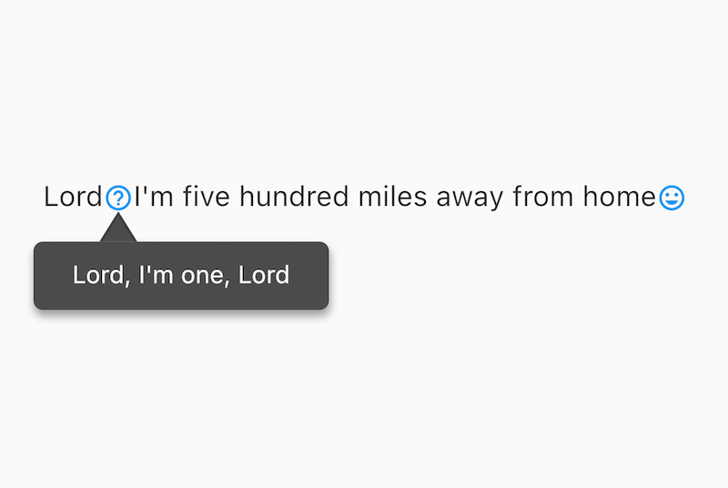
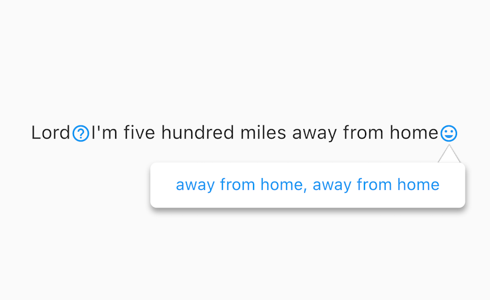

# popup_widget

A pop-up bubble text component, lightweight, easy to use.

## Getting Started

 

 

```
PopupWidget(
    child: Icon(Icons.help_outline, size: 16, color: Colors.blue),
    text: "Lord, I'm one, Lord",
    contentSize: Offset(16, 16),
);
```

## Contact
Github：[Github](https://github.com/linminjing888/popup_widget)
掘金：[minjing_lin](https://juejin.cn/user/1961184474981688)

